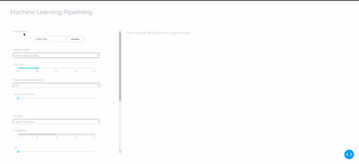

# Machine Learning Pipelining

This is a machine learning exploration app made using the Dash interactive Python framework developed by [Plotly](https://plot.ly/).




## Getting Started
### Using the demo

1) You can upload the labeled dataset (example dataset can be doung in data folder) in a dataframe format for binary classification.
2) Select target variable based on your dataset
3) Choose a feature selection/dimensionality reduction method
4) Choose classification model
5) The other dropdowns and sliders lets you change the parameters of your classifier, such that it could increase or decrease its accuracy.
6) You can save the trained model using 'Download' button

### Running the app locally

First create a virtual environment with conda or venv inside a temp folder, then activate it.

```
virtualenv dash-venv

# Windows
dash-venv\Scripts\activate
# Or Linux
source venv/bin/activate
```

Install the requirements with pip
```
pip install -r requirements.txt
```

Run the app
```
python3 app.py
```

## About the app
### How does it work?

This app is fully written in Dash + scikit-learn. All the components are used as input parameters for scikit-learn functions, which then generates a model with respect to the parameters you changed. The model is then used to perform predictions that are displayed on a contour plot, and its predictions are evaluated to create the ROC curve and confusion matrix.


## Built With
* [Dash](https://dash.plot.ly/) - Main server and interactive components
* [Plotly Python](https://plot.ly/python/) - Used to create the interactive plots
* [Scikit-Learn](http://scikit-learn.org/stable/documentation.html) - Run the classification algorithms and process the datasets


## Author
* **Christian Wibisono** - [@christianwbsn](https://github.com/christianwbsn)


## Acknowledgments
The whole project is heavily inspired from the [dash svm sample apps](https://dash-gallery.plotly.host/dash-svm/). Please go take a look!
